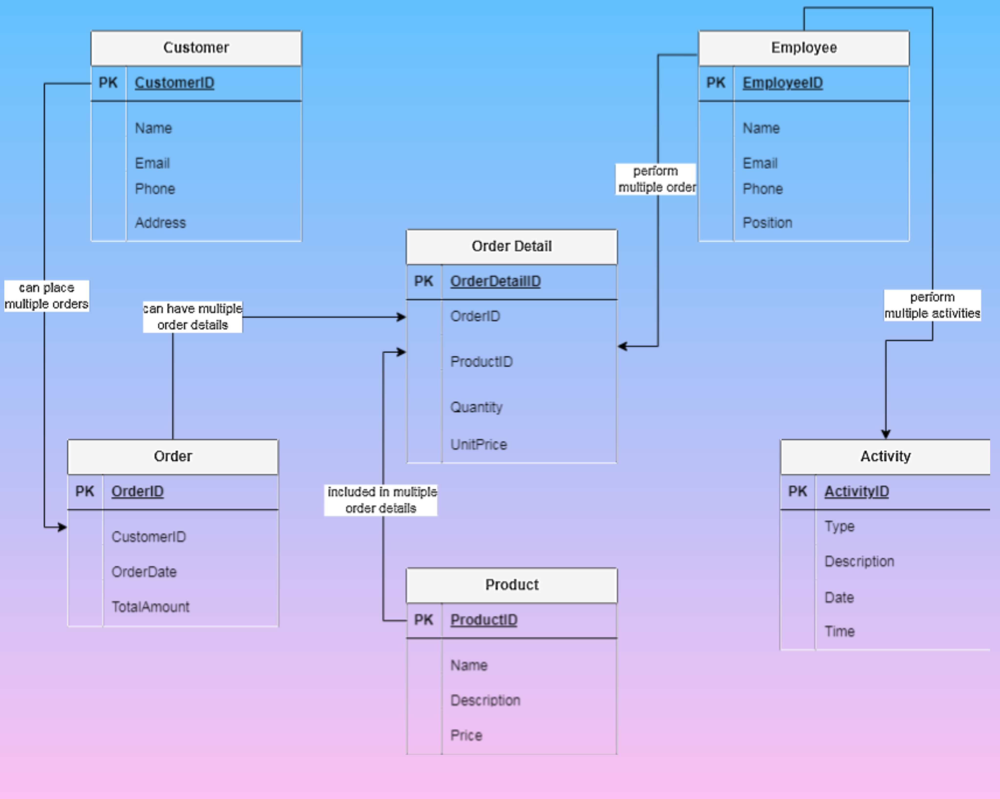

# Customer Relationship Management (CRM) SQL Project
A comprehensive SQL-based project focusing on Customer Relationship Management (CRM) for businesses.

## *Features*

- Database Tables: Customers, Products, Orders, OrderDetails, Employees, Activities
- Relationships: Properly defined foreign key constraints
- Extensive Queries: Includes more than 100 SQL queries for data retrieval, insights, and analytics

## ER Diagram 


## *Database Schema Overview*

### *Tables and Relationships*

1. *Customer Table*

Stores information about customers.

```
CREATE TABLE Customer (
  CustomerID INT PRIMARY KEY,
  Name VARCHAR(255),
  Email VARCHAR(255),
  Phone VARCHAR(20),
  Address VARCHAR(255)
);
```
2. *Product Table*

Stores details of products.

```
CREATE TABLE Product (
  ProductID INT PRIMARY KEY,
  Name VARCHAR(255),
  Description TEXT,
  Price DECIMAL(10, 2)
);
```

3. *Orders Table*

Tracks customer orders.

```
CREATE TABLE Orders (
  OrderID INT PRIMARY KEY,
  CustomerID INT REFERENCES Customer(CustomerID),
  OrderDate DATE,
  TotalAmount DECIMAL(10, 2)
);
```

4. *OrderDetail Table*

Details the products in each order.

```
CREATE TABLE OrderDetail (
  OrderDetailID INT PRIMARY KEY,
  OrderID INT REFERENCES Orders(OrderID),
  ProductID INT REFERENCES Product(ProductID),
  Quantity INT,
  UnitPrice DECIMAL(10, 2)
);
```

5. *Employee Table*

Manages employee information.

```
CREATE TABLE Employee (
  EmployeeID INT PRIMARY KEY,
  Name VARCHAR(255),
  Email VARCHAR(255),
  Phone VARCHAR(20),
  Position VARCHAR(100)
);
```

6. *Activity Table*

Logs activities within the system.

```
CREATE TABLE Activity (
  ActivityID INT PRIMARY KEY,
  Type VARCHAR(100),
  Description TEXT,
  Date DATE,
  Time TIME
);
```

## *Key SQL Queries* *Individual Tables*

- Retrieve all customers from the Customer table: `SELECT * FROM Customer;`
- Find products priced above $50: `SELECT * FROM Product WHERE Price > 50;`
- Get total orders by each customer: `SELECT CustomerID, COUNT(*) AS TotalOrders FROM Orders GROUP BY CustomerID;`

*Insights from the Entire Database*

- Get the total revenue from all orders: `SELECT SUM(TotalAmount) AS TotalRevenue FROM Orders;`
- List top 5 products by quantity sold: `SELECT ProductID, SUM(Quantity) AS TotalSold FROM OrderDetail GROUP BY ProductID ORDER BY TotalSold DESC LIMIT 5;`
- Find employees involved in the most activities: `SELECT EmployeeID, COUNT(*) AS TotalActivities FROM Activity GROUP BY EmployeeID ORDER BY TotalActivities DESC;`

*How to Use*

1. Clone the Repository: `git clone (link unavailable)
2. Set Up the Database: Execute the SQL scripts for table creation and relationships in your preferred database (e.g., MySQL, PostgreSQL, or Oracle). Load sample data using the provided scripts.
3. Run Queries: Use the provided SQL query files to extract insights or customize them to fit your needs.

## *Folder Structure*

```
crm-sql-project/
├── (link unavailable) # Project Documentation
├── schema.sql # Database schema
├── sample-data.sql # Sample data for testing
├── queries/ # Predefined SQL queries
│   ├── customers.sql
│   ├── products.sql
│   ├── orders.sql
│   ├── insights.sql
├── LICENSE # License file
```
